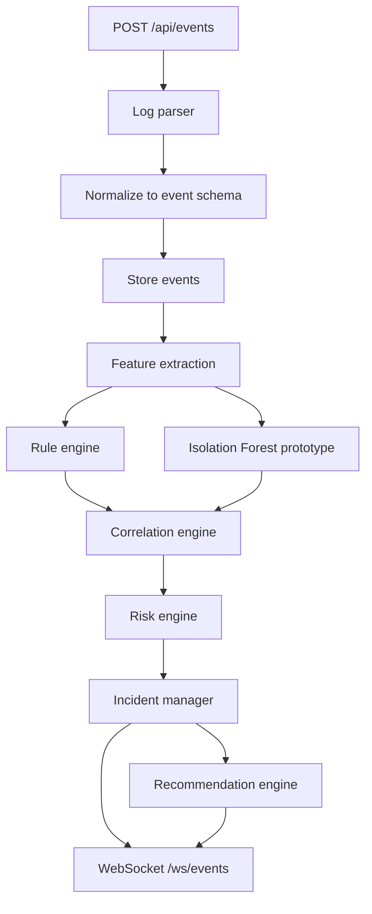

# LogShield architecture (Phase 1)

## Problem

Organizations produce more logs than analysts can review by hand. Isolated alerts hide multi-stage incidents (failed logins → success → restricted access → unusual network activity).

## Design principle

**Correlate first, then incident.** Multiple related events become one incident with a timeline, evidence, risk score, explanation, and defensive recommendation.

## Physical deployment

Three laptops on the **same LAN**. Laptop 2 is the server.

| Laptop | Process | Default listen | Outbound |
|--------|---------|----------------|----------|
| 1 Simulator | Python client | none | `http://$LOGSHIELD_SERVER_HOST:$LOGSHIELD_SERVER_PORT/api/events` |
| 2 Engine | FastAPI + SQLite + WS | `0.0.0.0:8000` | none required |
| 3 Dashboard | Vite/React | `0.0.0.0:5173` | HTTP + WS to Laptop 2 |

Environment (never hard-coded IPs):

- `LOGSHIELD_SERVER_HOST` — Laptop 2 address as seen by 1 and 3
- `LOGSHIELD_SERVER_PORT` — typically `8000`
- `LOGSHIELD_BIND_HOST` / `LOGSHIELD_BIND_PORT` — engine bind (Laptop 2)
- `LOGSHIELD_CORS_ORIGINS` — dashboard origins

Firewall (minimal, local network only): allow inbound TCP `8000` on Laptop 2; allow inbound TCP `5173` on Laptop 3 if others open the UI. Exact Windows/Linux commands are Phase 13.

## Logical pipeline (Laptop 2)



### Module map

| Package | Role |
|---------|------|
| `backend/app/api` | REST + health |
| `backend/app/models` | Pydantic + DB models |
| `backend/app/services` | Ingestion, incident lifecycle, stats |
| `backend/app/detection` | Rules + Isolation Forest |
| `backend/app/correlation` | Time-window grouping by user/IP/resource |
| `backend/app/risk` | Weighted 0–100 score + severity |
| `backend/app/database` | SQLite |
| `backend/app/websocket` | Fan-out: events, alerts, incidents |
| `simulator/` | Safe scenarios A–F |
| `frontend/` | SOC pages; **no hardcoded stats** |

## Normalized event schema

Extensible JSON; unknown keys go in `metadata`.

```json
{
  "event_id": "EVT-001",
  "timestamp": "2026-10-08T17:00:00Z",
  "source_ip": "10.0.0.41",
  "destination_ip": "10.0.0.10",
  "user": "jdoe",
  "event_type": "authentication",
  "action": "login_failed",
  "status": "failure",
  "resource": "vpn-gateway",
  "protocol": "https",
  "source_device": "laptop-sim-01",
  "metadata": {}
}
```

| Field | Notes |
|-------|--------|
| `event_id` | Assigned by engine if omitted |
| `timestamp` | ISO-8601 UTC |
| `event_type` | e.g. authentication, resource_access, network |
| `action` | e.g. login_failed, login_success, access_denied |
| `metadata` | Extensible bag (no secrets, no unnecessary PII) |

## Detection (hybrid)

**Layer 1 — rules:** known patterns (burst failed auth, access denied, unusual combos). Transparent reasons.

**Layer 2 — ML:** Isolation Forest on windowed features (counts, fail/success rates, unique sources, type distribution). Output `anomaly_score` in **0–100**. UI label: *prototype Isolation Forest anomaly detector*.

No claim of production detection accuracy.

## Correlation

Configurable window (`LOGSHIELD_CORRELATION_WINDOW_SECONDS`, default **300**).

Join keys (any match within window can attach an event to an open incident):

- user
- source_ip
- destination_ip
- resource
- related event types (auth → access → network)

Goal: Scenario F produces **one** incident, not six alerts.

## Incident lifecycle

```text
EVENT → ANALYSIS → ANOMALY → CORRELATION → INCIDENT
  → RISK → SEVERITY → EXPLANATION → RECOMMENDATION
  → ANALYST STATUS
```

Statuses: `NEW` | `INVESTIGATING` | `CONTAINED` | `RESOLVED` | `FALSE_POSITIVE`

## Risk (transparent, configurable)

```text
risk = 100 * (
  w_rule * rule_score
  + w_ml * ml_score
  + w_corr * correlation_score
  + w_beh * behavioral_score
)
```

Default weights: 30% / 30% / 25% / 15%. Display as **Risk Score: N/100**, never “N% probability of attack”.

Severity: 0–30 LOW, 31–60 MEDIUM, 61–80 HIGH, 81–100 CRITICAL.

Every incident stores contribution breakdown for the investigation page.

## Persistence (SQLite)

Tables (Phase 3): `events`, `incidents`, `incident_events`, `alerts`, `users` (analyst accounts, not org HR data), `system_status`.

## Real-time

WebSocket `/ws/events` publishes: new events, alerts, risk changes, incident create/update. Dashboard is a consumer only.

## Simulator scenarios (safe, predefined)

| ID | Name |
|----|------|
| A | Normal user activity |
| B | Repeated failed authentication |
| C | Failures then successful login |
| D | Suspicious resource access |
| E | Abnormal network behavior |
| F | Multi-stage correlated incident (demo centerpiece) |

## Trust and safety

- No remote exploitation, no payload execution from logs
- No cloud dependency for the basic demo
- Synthetic identities only
